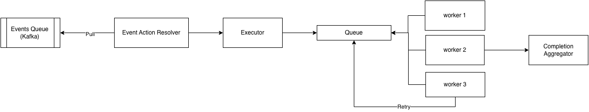

# System Design: IoT based Event Actions management system
Design a event based action worker system (similar to Zaiper)

events -> action(s)

ex: "turn on light" -> send email
                    -> send SMS
                    -> check data usage
                    -> etc

### Already existing system (Prerequisite)
- Kafka pipeline which pushed predefined events like `turn on light`

## Functional Requirements
- each event should run specific set of actions
- actions are predefined (like send email, send sms) (by API call)
- actions for each event will be defined by users
- after event execution need to store the status of each execution and each action

## Non Functional Requirements
- retry mechanism: each action may fail, and can / should be retried before terminating

## Entities

- Events
  - id
  - name

- Actions
  - id
  - name \\ "send email"
  - configuration \\ for defining how to perform action { "endpoint": "", method: "POST", "payload": {} }

- Event Actions
  - id
  - event_id
  - action_id

- Event Executions
  - id
  - event_id
  - status (in_progress, success, failed)
  - total_actions
  - completed_actions
  - failed_actions
  - created_at
  - completed_at

- Action Executions
  - event_id
  - action_id
  - retry_count
  - max_retries
  - status (in_progress, success, failed)
  - created_at
  - completed_at


## API Design

### Create event actions
```
POST api/v1/event-actions
{
  "event_id": {event_id},
  "actions": [action_id1, action_id2, ...]
}
```

### Update event actions
```
PUT api/v1/event-actions
{
  "actions": [action_id1, action_id2, ...]
}
```

## Heigh Level Architecture




<!-- 
kafka queue <-- Event Action Resolver -> Executor -> queue <- (workers) -> Completion Aggregator -->

### Event Action Resolver
- Resolves the actions from event names
- Sends actions and event details to Executor

### Executor
- Creates the `Event Executions` record (with not_started as init state)
  (with total_actions)
- Resolves `Actions` from event_id
- Pushes `Actions` to queue

### queue
- Simple Queue which holds actions
- If a action fails multiple times its moved to Dead Letter Queue

### Workers
- Pulls the actions from the Queue
- Creates `Action Executions` with status `in_progress`
- Performs the actions
- Updates `Action Executions` and increments `retry_count`
- if `retry_count >= max_retries` updates status to `success/failed`
- else push same `action` back to queue

### Completion Aggregator
- Increments `Event Executions.completed_actions` or `Event Executions.failed_actions`
- Updates `Event Executions.status` based on status of events