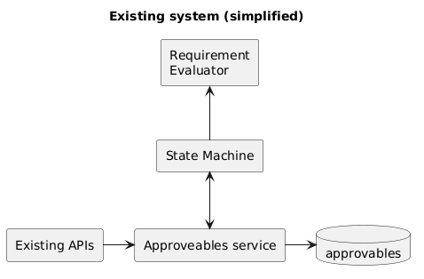
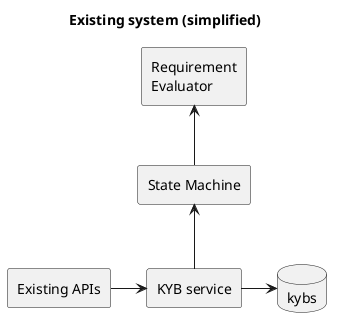
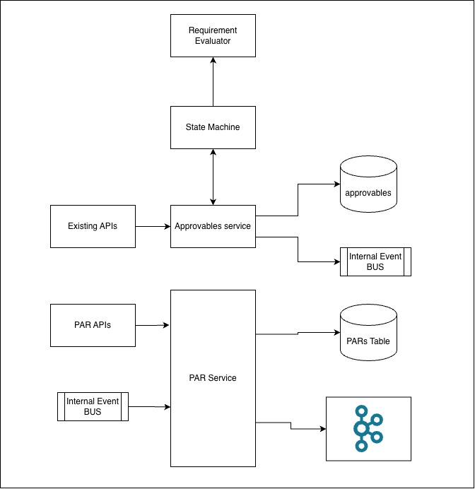
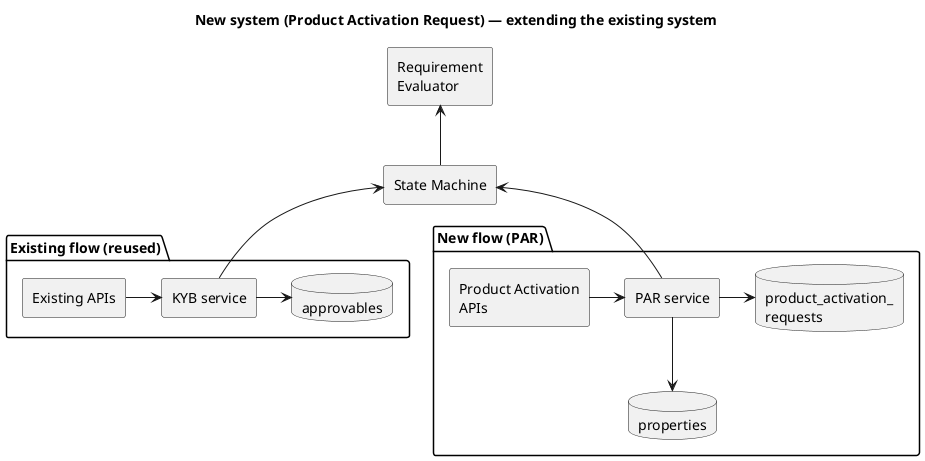
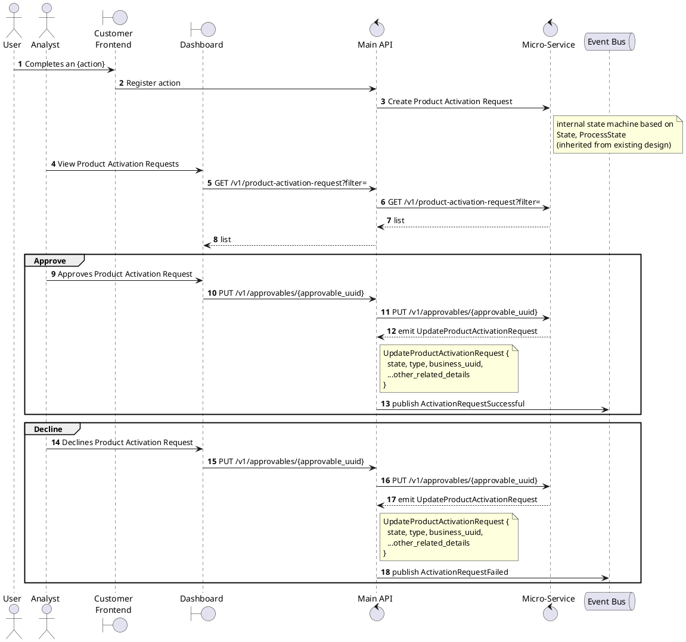

# Case Study: Product Activation Requests @ Aspire FT

## Background

Aspire FT is a multi-national scale up which provides business operating systems for businesses (from startups to large orgs).

As part of the Onboarding Team, there was a requirement to create a scalable, multi-purpose system which would act as a feature-flag-plus-requirement-check for different features — i.e. gate a feature behind an analyst-approved request rather than hard-coded logic.

## Problem

The existing system already had a mechanism for approving KYB and KYC of customers using a maker-checker flow (state machine + process state, missing-info flow, history tracking). But that flow was purpose-built for compliance (KYB/KYC) — it wasn't designed to be reused for arbitrary, non-compliance feature activations.

We needed a common framework for analyst-customer interactions on non-KYC/KYB activities, while still inheriting the parts of the existing flow that were already solid: maker/checker state machine, missing-info flow, and history tracking.

## Goal

Build a system that acts as the source of truth and requirement evaluator for any feature we release as an org, and that relieves the requirement overload on the onboarding team by progressively onboarding businesses/users based on their qualifications.

Evaluate requirements on a case-by-case, per-feature basis — so we don't overwhelm a business with every possible requirement up front, and instead ask only for what's required for the specific feature being activated.

## Constraints

- The Product Activation Request (PAR) needs to support the existing maker-checker mechanism (state, process_state, assignee).
- The requirements for each feature/product type need to be configurable via API — no hard-coding per feature.
- Must reuse existing primitives rather than duplicate them: `approvables` (state machine) and a generic `key-value` / properties store for additional data.

## Solution

### Existing system (reused, not rebuilt)



<details>
<summary>PlantUML source</summary>



</details>

- `approvables`: exposes APIs with state machines (`state_code`, `process_state_code`) and a requirements evaluator; already used to drive KYB/KYC.
- Missing-info flow: lets analysts ask/demand additional details from users when a request is incomplete.
- Properties / key-value store: a generic table pair (`properties` + `property_values`) already used elsewhere in the project to attach arbitrary typed data to any model via `model_uuid` + `model_type`.

#### State machines
State machines control the transition of `approvables.process_state` (and `state`) parameters — they allow or reject a transition between states, independent of what's being approved (KYB, KYC, or now PAR).

#### Requirements evaluator
Evaluates whether a transition is allowed by querying configured requirements from the DB and evaluating each against the entity (business/user), returning a per-requirement boolean result, e.g.:
```JSON
{
  "pob_available": true,
  "aml_completed": false,
  ...
}
```

### Proposed System



<details>
<summary>PlantUML source</summary>



</details>

#### Product Activation Types — configuration
A new table to define each type of PAR (e.g. "wire-transfers", "multi-currency-account") and its configuration/requirements, so new activation types can be onboarded via API without code changes.

#### Product Activation Requests
Stores each individual activation request: which type it is, which `approvable` it's tied to (reusing the existing maker-checker state machine by foreign key), and links out to the properties table for any additional structured data.

#### APIs and Events
Reused the `approvables` API surface for all state transitions (assign analyst, approve, decline) rather than building a parallel one, and added a thin PAR-specific API on top for creation, listing, and property updates.

High-level flow:


<details>
<summary>PlantUML source</summary>



</details>

Key endpoints:
- `POST /v1/product-activation-request` — create a request for a `product_slug` against a `business_uuid` / `business_group_uuid` / `application_uuid`.
- `GET /v1/product-activation-request?filter=` — list requests, returning `approvable_uuid`, business info, and any `additional_data` from the properties store.
- `PUT /v1/product-activation-request/{uuid}` — update PAR-specific properties only.
- `PUT /v1/approvables/{uuid}` — the existing, reused endpoint to assign an analyst and drive state/process-state transitions (maker-checker).

Events:
- `UpdateProductActivationRequest { state, type, business_uuid, ... }` — internal event on every transition.
- `ActivationRequestSuccessful` / `ActivationRequestFailed` — published externally for downstream consumers once a PAR is approved or declined.

#### Database design

**`product_activation_types`** — *new.* One row per configurable activation type.

| Column | Type |
|---|---|
| id | int, auto-increment |
| uuid | uuid |
| slug | string, unique |
| requirements | array |
| event_config | jsonb |

**`product_activation_requests`** — *new.* One row per request; delegates all state to `approvables`.

| Column | Type |
|---|---|
| id | int, auto-increment |
| uuid | uuid |
| type_id | → `product_activation_types.id` |
| approveable_id | → `approvables.id` |

**`approvables`** — *existing, shared maker-checker table.* PAR is just a new `type` value on it.

| Column | Type |
|---|---|
| id | int, auto-increment |
| uuid | uuid |
| type | enum: `product_activation_request`, `kyb`, `kyc` |
| model_type | string |
| model_uuid | uuid |
| analyst_uuid | uuid |
| state_code | string |
| process_state_code | string |

**`properties`** / **`property_values`** — *existing generic key-value store.* PARs attach `additional_data` here via `model_type = "activation_request"`.

| Table | Column | Type |
|---|---|---|
| properties | id | int, auto-increment |
| properties | uuid | uuid |
| properties | property_key | string, unique |
| property_values | id | int, auto-increment |
| property_values | uuid | uuid |
| property_values | property_id | → `properties.id` |
| property_values | model_uuid | uuid |
| property_values | model_type | string |
| property_values | value | json |

The core design decision: **PAR introduces no new state machine or storage primitive** — it's a thin new `model_type`/`type` on top of `approvables` and `properties`, plus one new configuration table for activation types. That's what made it deliverable quickly and kept maker-checker, missing-info, and history-tracking behavior for free.

## Interesting Engineering Challenges

- Making the requirements evaluator generic enough to express arbitrary per-feature checks (KYC-style booleans) without turning it into a rules engine that needed a redeploy per feature.
- Keeping `approvables` a truly shared primitive across KYB/KYC/PAR — any behavior added for one type must not leak into or break the others (e.g. state machine transitions had to stay parameterized by `type`).
- Avoiding schema sprawl: reusing the existing `properties`/`property_values` tables for PAR-specific data instead of adding bespoke columns per activation type.

## Outcome / Impact

01. Product Activation Request is currently being used across 4 features: 
- multi-currency accounts
- yield accounts
- prenexus / proof-of-business onboarding (US and APAC).
- stable coin accounts

02. On the `prenexus / proof-of-business` onboarding compliance flow, reduced customer acquisition cost from $210 to $175.
- Designed and implemented a US business onboarding system with proof-of-nexus compliance, enabling onboarding of 15–30 new businesses/day.
- Developed APAC onboarding flows for Singapore and Hong Kong with proof-of-business compliance, onboarding 50–70 businesses/day.

03. Processed ~15K yield accounts for HK customers through the same framework.

04. Powering the newly launched stable coin accounts activation flow.
